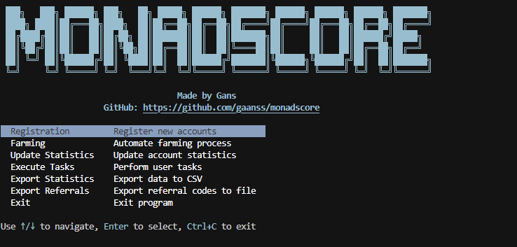

# MonadScore Bot

<p align="center">
  <a href="https://t.me/gans_software">
    
  </a>
  <a href="https://t.me/ganssoftwarechat">
    
  </a>
</p>

> **Note:** This is free software.



This tool automates your interaction with [monadscore.xyz](https://monadscore.xyz) by handling account registration, farming, task execution, and statistics collection.  

---

## 🚀 Features

- **🔐 Registration**  
  - Auto-register multiple wallets with random referral codes  
  - Thread-safe, with configurable parallelism & random startup delays  
  - Stores `token` & `refreshToken` securely in a local SQLite DB  

- **🌾 Farming**  
  - Activates "startTime" farming at a random time daily (00:10–01:00 UTC)  
  - Performs daily check-ins, scheduled 24 h apart + random offset  
  - Auto-refreshes JWTs using stored refresh tokens  

- **✅ Task Execution**  
  - Claims new tasks (`task009` → `task004`) once per account  
  - Tracks claimed tasks in the DB to avoid duplicates  
  - Updates account stats after each claim  

- **📊 Statistics**  
  - View real-time account data in the console  
  - Export statistics to a CSV file (`statistics.csv`)  

- **📑 Logging**  
  - Rich, colored console logs via **Loguru**  
  - Rotating file logs (`./logs/monadscore.log`) with 10 MB rotation & 7 day retention  

---

## 🛠️ Requirements

- Python 3.9+  
- **Virtual environment** best practice  
- Dependencies managed in `requirements.txt`:
  ```
  curl-cffi==0.10.0
  loguru==0.7.0
  PyYAML==6.0
  eth-account>=0.8.0
  APScheduler==3.9.1
  PyJWT>=2.8.0
  ```

---

## ⚙️ Installation

1. Clone the repo  
   ```bash
   git clone https://github.com/yourusername/monnadscore.git
   cd monnadscore
   ```
2. Create & activate a venv  
   ```bash
   python -m venv venv
   source venv/bin/activate     # Linux/macOS
   venv\Scripts\activate.ps1    # Windows PowerShell
   ```
3. Install dependencies  
   ```bash
   pip install --upgrade pip
   pip install -r requirements.txt
   ```

---

## 📝 Configuration

Edit **`settings.yaml`** to adjust:

```yaml
threads: 5            # how many accounts to process in parallel
startup_delay:        # random delay before each account starts
  min: 5              # minimum seconds
  max: 15             # maximum seconds
retry:
  attempts: 3         # number of HTTP retry attempts
  delay: 5            # seconds between retries
proxy_file: data/proxy.txt
private_key_file: data/private_key.txt  # one private key per line (ignored if wallet_file is set)
wallet_file: data/wallets.txt           # optional: one wallet address per line
invite_file: data/invite.txt
database: data/monadscore.db
```

Place your data files:

- `data/private_key.txt` – one private key per line  
- `data/wallets.txt` – optional: one wallet address per line (use instead of private keys)  
- `data/proxy.txt`       – one proxy per line (`username:password@ip:port`)  
- `data/invite.txt`      – one referral code per line  

---

## 📖 Usage

Run the main script:

```bash
python main.py
```

You'll see a menu:

```
Select mode:
1. Registration
2. Farming
3. Execute tasks
4. Export statistics to CSV
0. Exit
```

### 1️⃣ Registration  
Reads `private_key.txt` or `wallets.txt` & `invite.txt`, skips wallets already in DB, registers new accounts, logs in, and persists tokens & stats.

### 2️⃣ Farming  
Starts background scheduler to:
- Refresh tokens if expired  
- Activate farming at random UTC times (00:10–01:00)  
- Perform daily check-ins  

### 3️⃣ Execute tasks  
Claims a predefined list of tasks **once** per wallet, updates stats, and records claimed tasks.

### 4️⃣ Export to CSV    
Writes `statistics.csv` in the CWD with all account fields.

---

## 🔒 Logging

- **Console**: colored, leveled logs via Loguru  
- **File**: rotating file sink in `./logs/monadscore.log`  
  - Rotates every **10 MB**, retains last **7 days**

---

## 📜 License

This project is released under the [MIT License](LICENSE).  